***\*NBM7100 电池能量管理设备\****

也可以参考这边的代码 > https://github.com/thomas169/nbm

# **一、** ***\*引言\****

NBM7100是一款电池能源管理设备，设计用于在需要突发电流负载的低压、低功耗应用中最大化非可充电电池的可用容量。这些设备克服了从硬币电池等电池中提取高脉冲电流所带来的电压降和电池寿命限制。这些电池通常用于无线、低功耗的物联网传感器应用。

# **二、** ***\*硬件设计\****

## **1、** ***\*芯片原理\****

NBM7100包含两个高效DC-DC转换阶段和一个智能学习算法。第一阶段DC-DC转换以低恒定电流从电池向电容存储元件传输能量。一旦充电，第二个DC-DC转换周期利用这个存储的能量在VDH输出引脚上提供具有高脉冲负载电流能力的稳定电压。电池永远不会直接受到大的负载脉冲电流，从而导致更长、更可预测的电池寿命。专有的学习算法监视在重复负载脉冲周期中使用的能量，并优化第一阶段DC-DC转换，以最小化存储电容器中的剩余电荷.

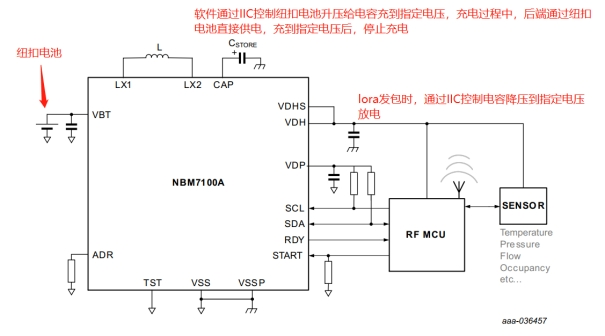 

# **三、** ***\*软件设计\****

## **1、** ***\*通信接口\****

l NBM7100A:总线接口I²C,速率最高可达1MHz.

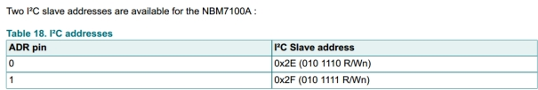 

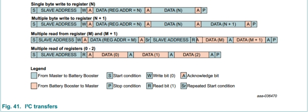 

l NBM7100B:总线接口是SPI,速率最高可达4 MHz .

l NBM7100A(**独有**):接口是START引脚,模式**:Auto Mode.**自动模式利用START引脚来设置而不需要串行总线。

## **2、** ***\*芯片状态流程\****

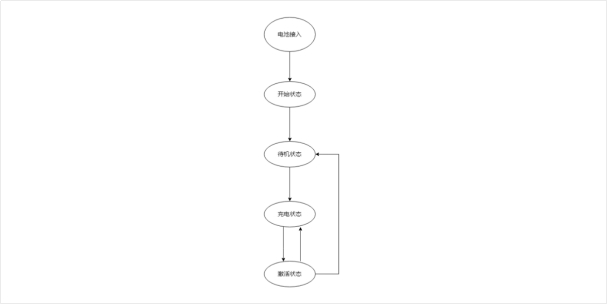 

状态之间运行切换逻辑如图所示;

### **a)** ***\*电池接入\****

​	即上电时,分为两种情况;电池接入上电和非电池接入上电两种情况.

l 非电池接入上电

​	**不允许操作;**电源由VDHS输入,例如串口小板供电;芯片将会启动,但下发的配置值将会无法生效,目标充电电压将会为默认值9.9V;电容默认开始升压,可能导致电容损坏.

 

l 电池接入上电

​	合法操作;芯片将会启动,电容将不会默认升压充电;仅当下发配置修改时,才会启动电容充电升压;

### **b)** ***\*开始状态\****

l 当VBT引脚检测到电池或其他电压源且检测到的电压高于VPOR电平时，内部电源开关连接VBT并输出VDP和VDH(参见POR VBT快速斜坡)。启动后大约20毫秒进入备用状态.

l 寄存器在启动时的处于默认状态。启动状态时进行读取寄存器操作可能导致非易失性内存损坏。应当在约20ms后，设备进入Standby状态时进行寄存器读写.

### **c)** ***\*待机状态\****

l 待机状态是一种低功耗工作状态，其中静态电流消耗几乎可以忽略不计,从电池引出的电源电流很低;

l 当设备处于“待机”状态时，设备设置可编程。

### **d)** ***\*充电状态\****

l 以VBT为输入，CAP为输出，使能DC-DC升压转换器。外部存储电容为从VBT中使用恒流充电。

l 可以使用正常充电设置和一个高电流(紧急)设置。正常充电电流是为了限制电池电流以获得最佳效率和电池寿命。充电电流越低，对存储电容充电的时间越长。

l 在较短的情况下充电时间高于电池寿命，可采用紧急充电模式。在紧急情况下模式，电池电流增加到50mA。

### **e)** ***\*激活状态\****

l 在活动状态下，VDP 和 VDH 输出均由集成开关稳压器提供，并使用存储电容器作为其能源。在此状态下，NBM7100A/B 从电池消耗的电流非常低。

## **3、** ***\*芯片操作模式\****

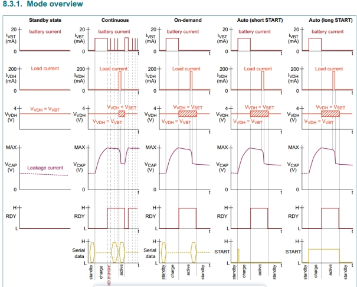 

### **a)** ***\*连续模式\****

l 连续模式适用于需要即时脉冲负载能力的应用。在连续模式下，外部存储电容器充电，DC-DC 转换器空闲。电容引脚电压受到监控，如果电容器电压 到低于目标充电电压时，则 DC-DC 会自动启用，以将电容器充电至目标电压。

### **b)** ***\*请求模式\****

l 此模式旨在最大限度地延长系统大部分时间处于睡眠模式的低占空比应用中的电池寿命。在此模式下，能量首先从电池中提取并存储在连接到 CAP 引脚的电容器中。然后，所存储的能量可在全功率下作为 VDH 引脚上的稳压电源电压使用。 

### **c)** ***\*自动模式(NBM7100A独有)\****

l 从待机模式，在 START 引脚上施加一个短脉冲 (≥ 10 µs)。充电周期启动，然后自动转换到活动状态。

l 从待机模式，START 引脚被驱动为高电平并保持高电平，直到活动周期开始（如 RDY 引脚上的高电平跳变所示）。当 START 引脚被驱动为低电平时，活动状态结束。

## **4、** ***\*代码驱动流程\****

### **a)** ***\*NBM7100驱动流程\****

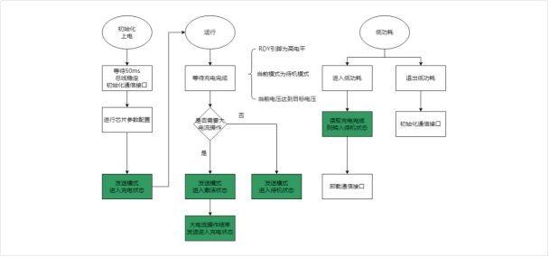 

#### **一、** ***\*初始化操作\****

l 需执行延时操作;NBM7100芯片上电20ms内执行通信操作可能导致寄存器异常;

#### **二、** ***\*RDY引脚读取配置\****

l RDY连接引脚配置为读取模式,并设置为边沿中断触发模式,中断优先级设置为0;

l 配置为中断模式,可在进入低功耗时触发唤醒,进行发包或设置为待机模式;更加及时;

#### **三、** ***\*等待充电完成判断方式\****

l **读取RDY引脚**

\1. RDY引脚**高电平**则充电完成;RDY引脚**置低**,则充电未完成或发生异常;

\2. 实际使用时,发现RDY引脚在充电完成时**可能不会置高;**例如测量电容电压已满足条件或读取寄存器当前电压已达到目标电压,而RDY引脚并未置高;

l **读取寄存器当前电压达到目标电压**

\1. RDY引脚无法很好判断是否充电完成;增加读取当前电压方式来判断是否充电完成;

l **判断当前设置模式为待机模式**

\1. 由于低功耗要求,当充电完成,没有需要进行激活操作时,需要节省功耗;故而在退出低功耗时判断当前充电完成则进入待机模式;

\2. 在待机模式下,RDY引脚不会置高,所以需要判断当前模式为待机模式时,认为充电完成;

#### **四、** ***\*低功耗操作\****

l 进入低功耗时判断是否需要进入待机模式并执行

### **b)** ***\*LORA应用发包流程\****

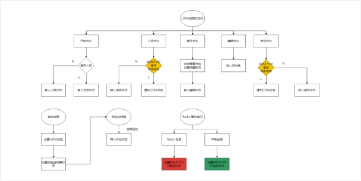 

#### **一、** ***\*读取充电是否完成\****

l lora发包时需要开启激活模式,提供大电流;否则,电池供电不足,将会降低电池电压,导致芯片欠压复位;

l 判断充电完成时,执行原lora流程;判断充电未完成时,将状态转入循环状态,以便进入低功耗;

#### **二、** ***\*设置激活模式与充电模式\****

l 可行方案:

\1. 在RadioSend()中设置为激活模式,在LoRaMacHandleIrqEvents()中设置为充电模式;

l 不可行(不合适)方案:

\1. 在状态机中判断充电完成后立刻执行激活模式;在OnTxData回调中设置为充电模式;

lora协议栈在发送上行数据后,打开RX窗口阶段接收到下行ACK数据时,需要发包回复;此时并不会重新执行至状态机中,不会设置为激活模式,导致设备欠压复位;

\2. 在OnTxData回调中设置为充电模式;

lora协议栈可能未发送成功数据,例如发送超时;导致不会进入OnTxData回调;

\3. 在radio.c文件中,在RadioSend()中设置为激活模式,在RadioIrqProcess()中设置为充电模式;或在中断回调事件中设置为充电模式

由于设置模式需要执行通信写入操作,会有**阻塞等待**的可能性;在中断中操作不合适;

## **5、** ***\*代码参考\****

### **a)** ***\*配置\****

l 非模式配置采用结构体形式传入;初始化时填入并传输至芯片

l 配置参数具体含义查看代码注释

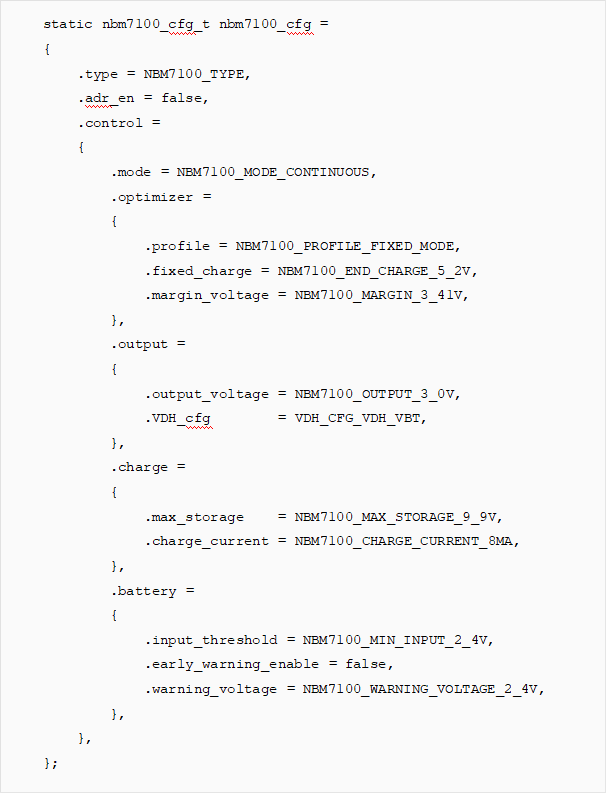 

### **b)** ***\*设置模式\****

l 由于芯片状态机切换要求;当芯片处于待机模式时,必需先切换为充电状态,才能切换为激活状态

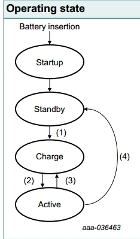 

l 第一次设置为激活模式后,需切换为充电模式等待再次充满才可激活;

此为芯片特性?官方DEMO也需要如此操作,充电电压才可达到目标电压;

l 下发模式配置后,转入充电或激活状态时,不再接受配置;配置需先发送后,在进行模式配置;

### **c)** ***\*获取充电状态\****

l 会执行通信接口的读取操作;需注意多线程调用情况

### **d)** ***\*充电电流\****

l 初始化默认配置为8mA,以加快第一次上电时,电容充电速度

l 第一次充满后,更改充电电流为4mA,延长电池寿命;

### **e)** ***\*调试接口\****

l nbm7100_read

打印芯片状态信息,异常状态,充电电量,当前电压与目标电压

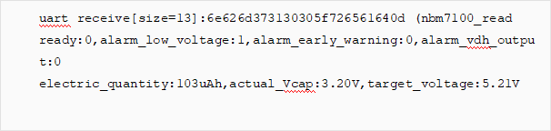

l nbm7100_set_mode %lu

输入模式值,强制开启对应模式

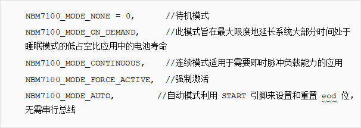 

l nbm7100_set_ma %lu

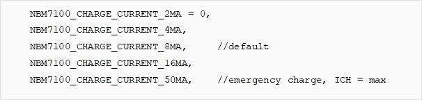

l nbm7100_set_no_continuous %lu

# **四、** ***\*注意事项与异常处理\****

## **1、** ***\*硬件\****

### **a)** ***\*电容耐压值\****

\1. 注意芯片配置的目标电压是否超过电容耐压值,或接近电容耐压值

\2. 若持续充电,导致电容电压大于电容耐压值,可能导致电容损坏,无法存储额定容量,导致激活发包失败,欠压复位;

\3. 若目标电压解决电容耐压值,由于电容生产存在误差,可能该电容耐压值比描述的耐压值小;导致第二点所示问题.

### **b)** ***\*串口日志打印缺失\****

\1. 接入串口进行日志打印;可能存在日志打印缺失情况

TTL串口电压小于2.8V时,日志无法打印;由于串口输出由芯片供电,当NBM7100后端输出小于2.8V时,日志将无法打印;

### **c)** ***\*配置后充电过慢\****

\1. 下发模式命令不对,导致芯片还在待机模式;

\2. 配置未发送完成,先发送模式;导致后续配置模式未生效;

### **d)** ***\*发包后欠压复位\****

\1. 第一次设置为激活模式后,需切换为充电模式等待再次充满才可激活;

此为芯片特性?官方DEMO也需要如此操作,充电电压才可达到目标电压;

\2. 电容损坏,更换电容

\3. 发包时数据内容太长[字节数>50],导致长时间处于大电流状态,电容容量耗尽,欠压复位;

\4. 可能存在LORA连续发包情况,电容无法满足持续发包;

### **e)** ***\*I2C通信时,芯片无ACK应答\****

\1. 电容电压高于设置的值后,I2C通信无应答

\2. 电容损坏,更换电容

### **f)** ***\*用串口供电烧录时,电容会有声音\****

\1. 电容损坏,更换电容

## **2、** ***\*软件\****

### **a)** ***\*驱动方式\****

\1. 写入方式: 	初始化时所有寄存器一并发送写入;特殊参数额外单独寄存器发送

\2. 读取方式:	所有寄存器一并读取;从寄存器地址0开始读取;

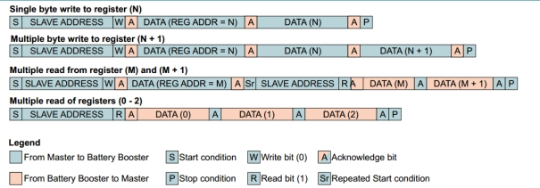 

芯片在I2C通信时允许从指定寄存器地址开始读取;由于I2C读写函数问题,写入地址后到执行读取中间有延时,导致无法被判断为从指定寄存器地址读取;

### **b)** ***\*异常处理\****

\1. 验证过程中,发现通信失败异常情况;增加异常处理容错机制

设置模式失败后,下次判断充电状态时重新发送模式

\2. 初始化时,判断配置失败,立刻重启设备重新配置;

由于配置失败,芯片将会使用默认配置;若不重新配置,直接进行充电;将会使用目标电压为9.9V进行充电,可能导致电容损坏;

### **c)** ***\*未编写方案\****

\1. 现有验证方案,没有在每次发包前都去判断充电完成再去发包;

可能导致连续多个包需要发送时,电容容量不够发包;导致欠压复位;

现处理方案为:提高目标电压,支持连续发送两个包

\2. 可支持方案:每次发包前判断当前是否完成充电;完成充电再去发包,未完成充电阻塞等待充电完成后发包;需挂起线程

# **五、** ***\*统计\****

## **1、** ***\*功耗\****

l 使用IoT Power软件打开

l 开机低功耗,进入充电模式,13S功耗:0.3119uAh

l 开机低功耗,进入待机模式,电流:3uA

## **2、** ***\*电池寿命\****

l 使用CR2450新电池[600mAh]进行挂测,芯片配置为4mA充电电流,目标电压5.21V

l 采用CN470频段[8-15] SF12发包 30S进行一次唤醒判断是否可以发包

l 挂测持续7天;连续SF12发包8000+,后续发送入网包1200+;

l 后续电池电压不够,仅能发送入网包后重启,持续该过程

l 挂测结束后测量电池电压2.4V,电容电压4.7V

## **3、** ***\*对比\****

l 理论发包数:

SF12 CN470发包 消耗 40uAh;

CR2450新电池[600mAh] * 0.8 = 480,000uAh

计算理论发包数为 12000包 

l 原采用电容直接充电方式,进行电量存储;超级电容方案:包数:1300,锂电容方案:4300

超级电容效率为:**10%**

锂电容为:**36%** 

l 现采用NBM7100芯片,包数9000+

效率约为**75%** 